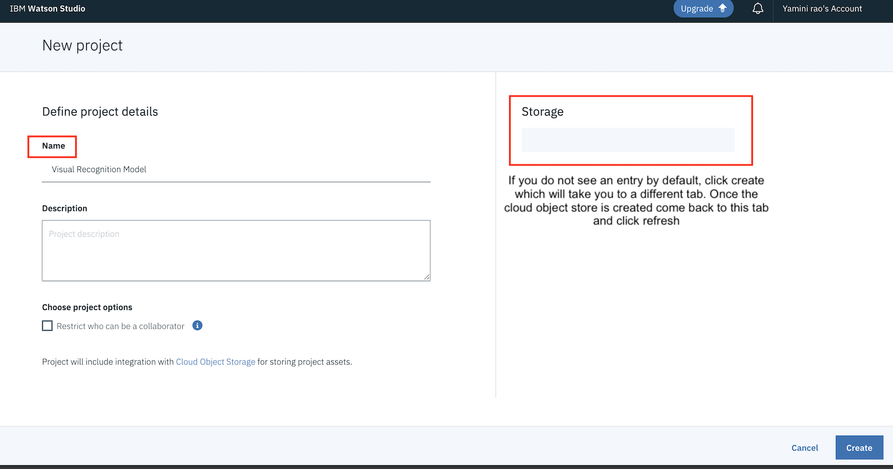
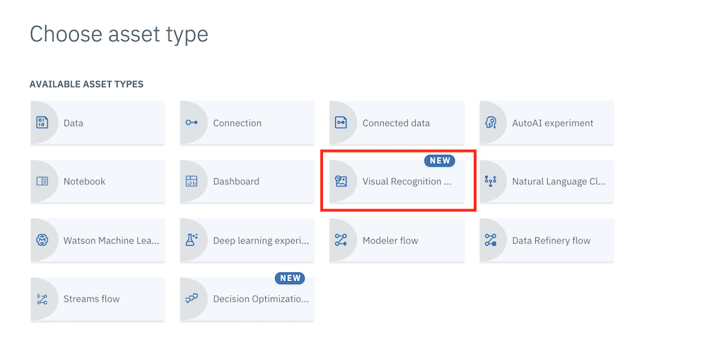
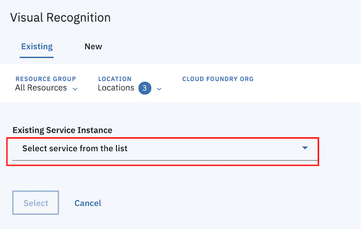
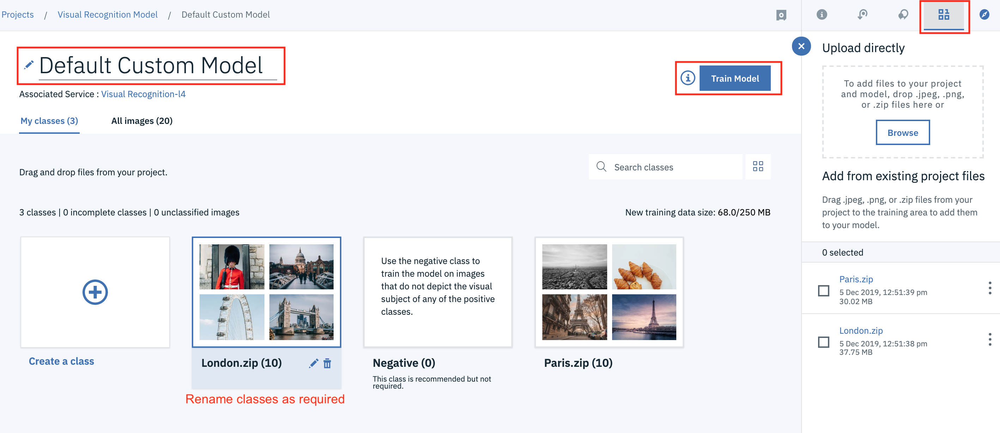
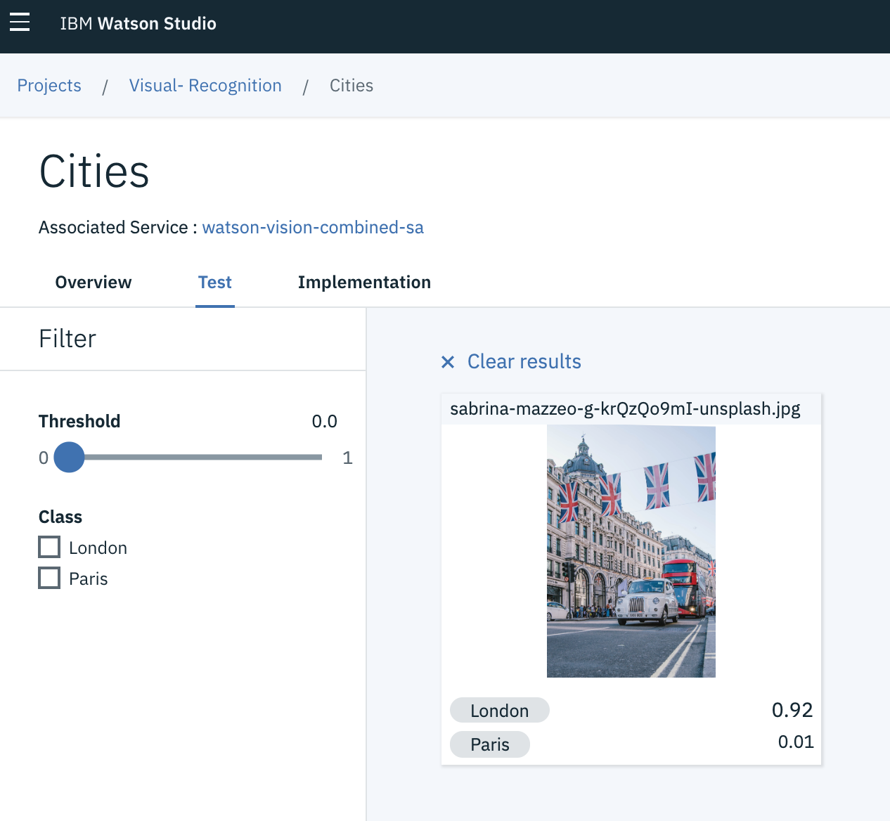

- Navigate back to the IBM cloud Dasboard and click `Create Resource` at the top right. 

 (You can find the resources under the hamburger menu at the top left)

 
 
- Search for Watson Studio and click on the tile:

- Select the Lite plan and click `Create`.
- Go back to the Resources list and click on your Watson Studio service that you find under `Services` and then click `Get Started`. 

## IBM Watson Studio

#### 1. Create a new Project

- You should now be in Watson Studio.
- Create a new project by clicking on `Get Started` and `New Project`, or `Create Project`
- Give your Project a name.

**Select an Object Storage from the drop-down menu or create a new one for free. This is used to store the notebooks and data. Do not forget to click refresh when returning to the Project page.**

- Click `Create`.  

#### 2. Once the project is created, Click 'Add to Project' on the top right and select 'Visual Recognition' as shown below 

#### 3. Associate a service 

You will need to associate a Visual Recognition Service, As we have already created one as part of the previous workshop you will find it in the drop down. 

Click on the hyperlink provided to associate your service and select the 'existing' tab to choose your service from the drop down menu. 

#### 4. Create and Train Custom Model 

Under the Custom Models options, we will be using 'Classify Images' , click on 'create model' under this category. 

You will see the below page, give your model a Name and use the 'Find and add Images' option on the top right corner to add your Zip files. 

Classes are created automatically based on your zip files, but you can create a new class and add images as needed as well. 

Rename your classes as required. 

Click #Train Model once all steps are completed. 

(Take a break, this may take a few minutes) 

#### 5. Test your model 

Once the training is complete you will see the following message

Click to add an image and train it against the custom model you created. 

The image will be trained against all the classes part of your model. You can edit and retrain your model to improve results. 

