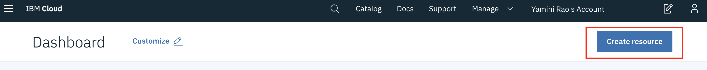
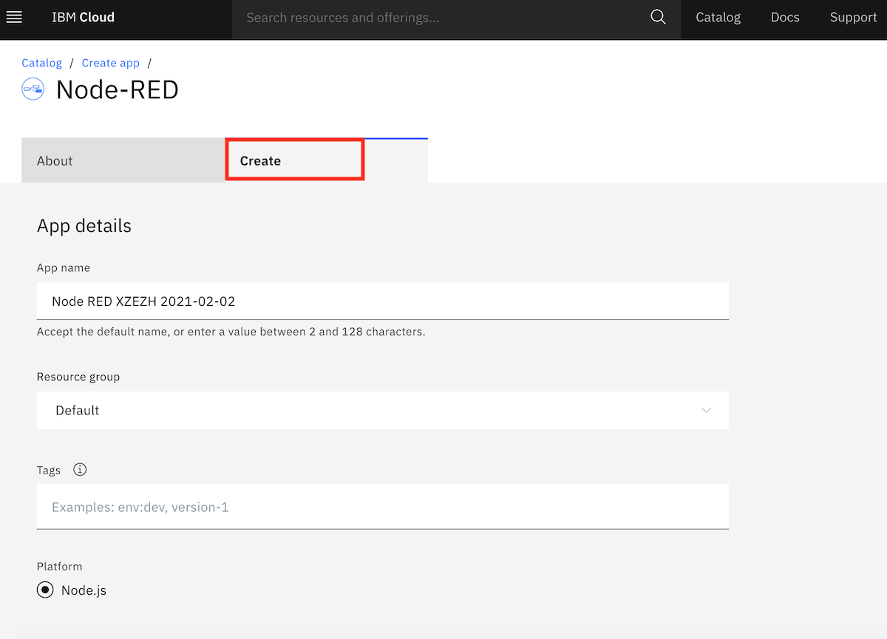
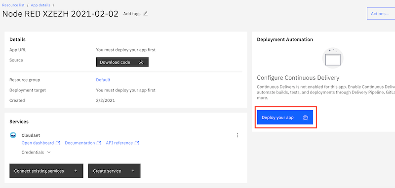
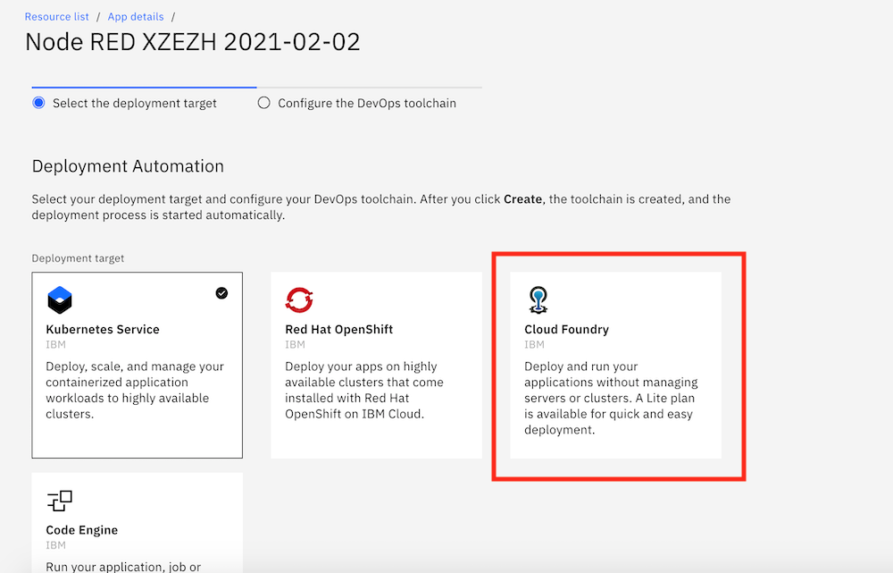
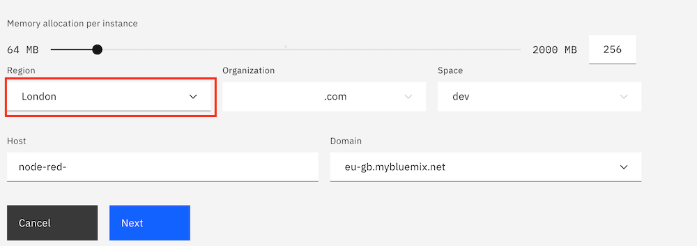
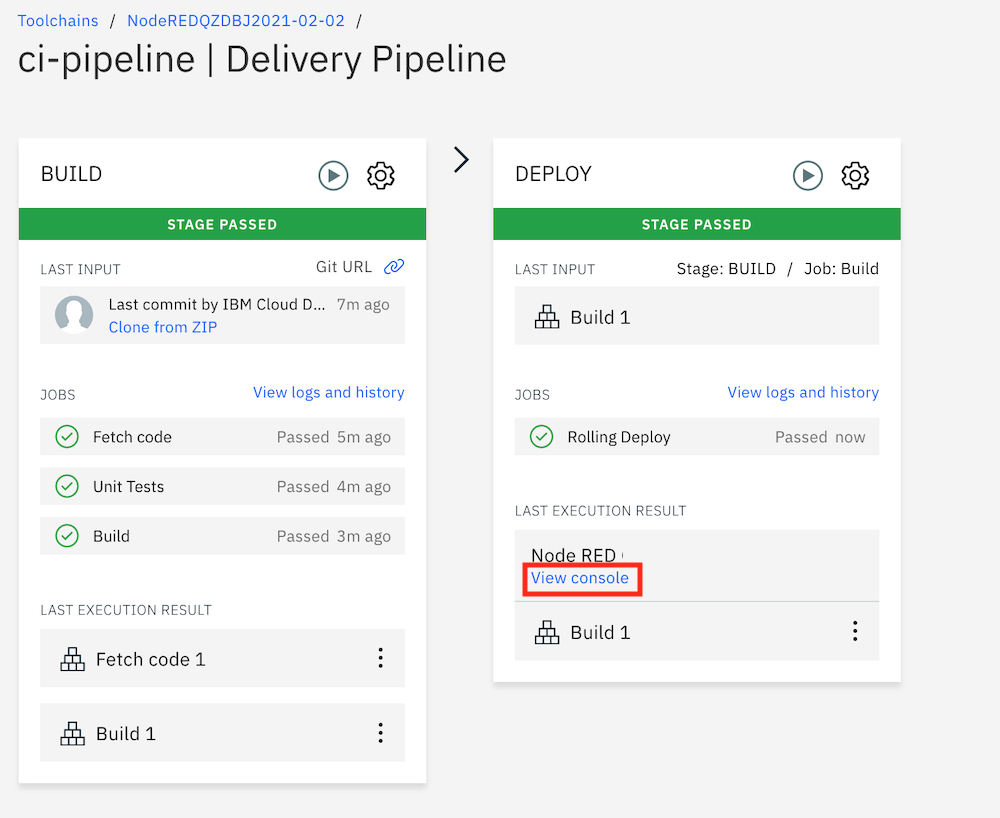
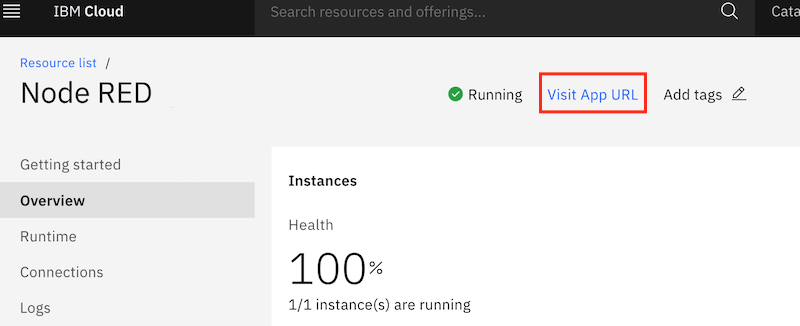
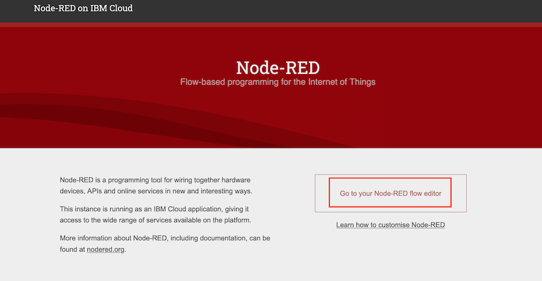

## Step 1 

   • Using the <b> "Create Resource" </b> Option at the top right corner look for <b> "Node-Red App" </b>
   
   • You can also use the Search bar to do the same

## Step 2 

  • Click on the <b> "Create" </b> tab and select your <b> "Region" </b> to create your application 

## Step 3

You will be redirected to the App Details page, where you will need to Confirgure the Continous delivery pipeline. Select the "Deploy your app"  option as shown below 

## Step 4 

 • On the next step choose <b> Cloud Foundry </b> as your deployment target 
   
   
   
 • You will also need to include the IBM Cloud API Key, Click on <b> "New" </b> to generate your API key. 
 
 
 
 
 ## Step 5 
 
 • Select your specific <b> Region </b>. This should be the same as what you provided in the first step while creating the application. 
 
  
 

## Step 6 

• When you click next you will see details about the 

 - <b> Deployment Automation </b> : Name, Location and Tool Integrations 
 
 - <b> Delivery Pipelines </b> : Wait for the Status to change to <b> Success </b> and Click on the link 
 
 ## Step 7 
 
 • Your Build and Deploy stages should be successful. Click on the "View Console" option once both stages are completed successfully. 
 

 
 • Your App runtime is now ready to use : Click on the "Visit app URL" option to access your Node-RED Flow editor
 
 
 
 ## Step 8 
 
  • You will be redirected to the below page, click on the " Go to your Node-RED flow Editor" option and follow through with the next steps to launch the application 
  
   
