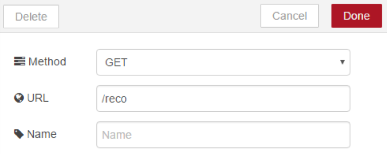
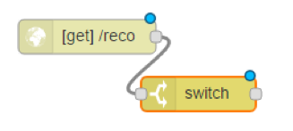
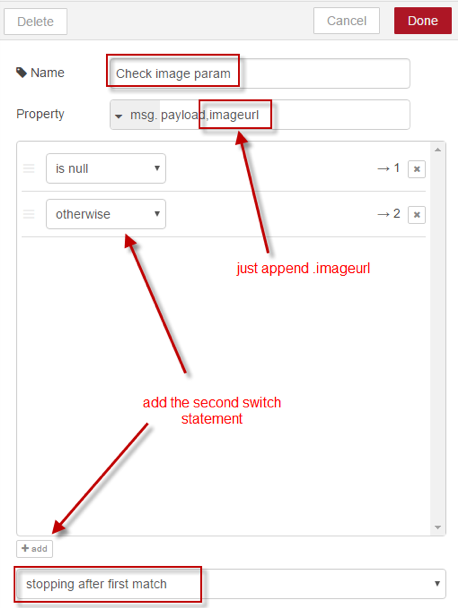
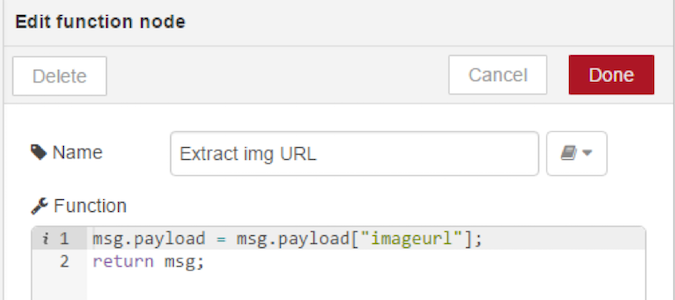
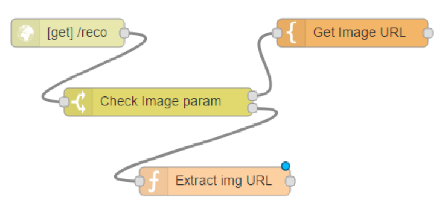
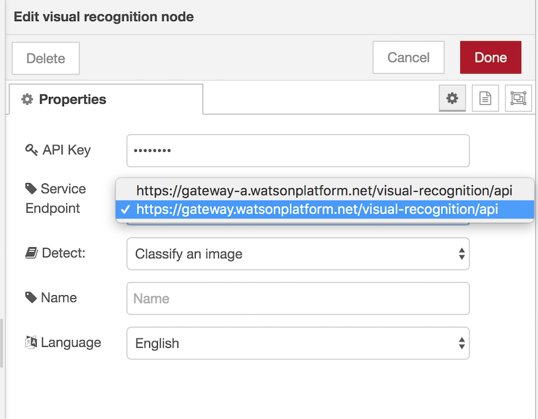
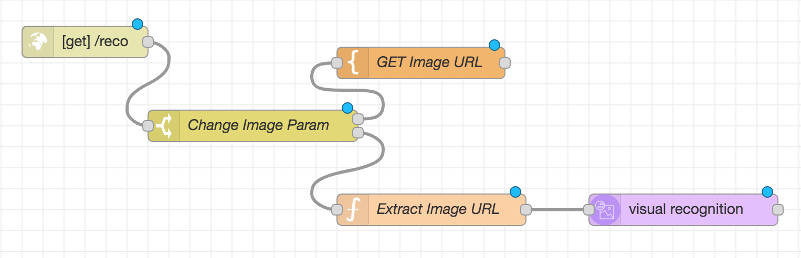
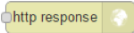

# Node-RED-and-Watson-Visual-Recognition

## Overview 

This workshop will use the Visual Recognition service to show the integration into Watson Cloud services.
Node-RED is a visual tool for wiring the Internet of Things. It is easy to connect devices, data and API’s (services). It can also be used for other types of applications to quickly assemble flows of services.

Node-RED is available as open source and has been implemented bythe IBM Emerging Technology organization. Node-RED provides a
browser-based flow editor that makes it easy to wire together flows using the wide range of nodes in the palette. Flows can be then deployed to the runtime in a single-click. While Node-Red is based on Node.js, JavaScript functions can be created within the editor using a rich text editor. A built-in library allows you to save useful functions, templates or flows for re-use.

Node-RED is included in the Node-RED starter application in IBM Cloud but you can also deploy it as a stand alone Node.js application. Node-RED can not only be used for IoT applications, but it is a generic event-processing engine. For example, you can use it to listen to events from http, websockets, tcp, Twitter and more and store this data in databases without having to program much if at all. You can also use it for example to implement simple REST APIs. You can find many other sample flows on the Node-RED website.

This app in this lab will be created and run on your IBM Cloud Account.

• In a first step, a IBM Cloud Node-RED environment will be created and setup. This will then host your Node-RED flows.

• Next you will create a simple Node-RED flow that allows you to past an Image URL from the Web and pass it to the IBM Watson Visual Recognition service

## Before you begin 

Before setting up your environment, and in order to create the services needed for the workshop, you'll need an IBM Cloud account. 

1. [Sign up for an account here](https://cloud.ibm.com/registration)
2. Verify your account by clicking on the link in the email sent to you


## Step 1 

### Create a Visual Recognition service

1. Click the "Create Resource" Option at the top right corner 


 

2. Seach for 'Visual Recognition' and select the 'Lite Plan' and click 'Create' 


3. After the service is created navigate to the 'Service Credentials' option on the left pane and click on 'View credentials'  from your Auto-generated service credentials

4. Among the list of credentials displayed, `copy the "apikey"` for later use into a file on your workstation. 
(You can always go back to the IBM Cloud console to copy the credentials from your list of services when you need them)


## Step 2 

### Run Node-RED using IBM Cloud

1. Log in to your [IBM Cloud account](http://cloud.ibm.com)
2. Click on "Catalog" at the top-right corner
3. Search and select "Node-RED Starter" 
4. Give a unique name to your app and click "Create"
5. Once your app is created you'll be able to access it through the [resource list](https://cloud.ibm.com/resources)

Click the 'Visit App URL' option to access your Node-RED instance in your browser. (click next for the steps displayed until you see the option 'Go to your Node-Red Flow Editor', and select "Not recommended: Allow anyone to access the editor and make changes" for the second step. 


## Step 3 (Optional)

A Node-RED Flow editor opens with an empty panel named Flow 1. 

Rename your Flow via the menu to IBM Node-RED Lab. Click Done. 


 ## Step 4 
 
In the left navigation pane of the Editor you will see a lot of standard Node-RED nodes. At the end of the list there are certain categories already customized by IBM, such as `IBM_Watson`. 

As a first step, 
From the input category of nodes drag the  node and drop it on the editor pane. 

When you click on each node to highlight it,the 'Info' tab on the right navigation pane will give you some information about the selected node. 
 
 
 
 ## Step 5 
 
 Double click the http input node and specify the Method as a http GET request .Specify a name for your url which in this case is /reco
 You will be able to access the endpoint by removing everything after appdomain.cloud/ in your URL, and replacing it with /reco
 
 Click Done once completed. 

 

 ## Step 6
 
 As you might have noticed, all the nodes are classified into different categories on the left pane. 
 From the 'function' nodes drag a  node and drop it on the editor pane. 
 
 Select the output of the /reco node and drop it on the input of the switch node.  
 
  
 
 ## Step 7 
 
 Double click the switch node and enter the info shown on the following image and click Done.
 
  
 
 ## Step 8 
 
From the function section of nodes drag a 'template' node and drop it on the editor pane and connect the “is null” output of the switch to the input of the template.


Double click the template and specify the following information: 

 a.	Name: Get Image URL
 b. Leave property as msg.payload
 c. Syntax Highlight: HTML 
 d. Format: Moustache template Template: 
 e. Paste the following code in the Template field

```


    <style>
input[type=submit]{
    background-color: rgb(85,150,230);
    border: none;
    color: white;
    padding: 16px 32px;
    text-decoration: none;
    margin: 4px 2px;
    cursor: pointer;
    font-size: 15px;
    border-radius: 10px;
)
input[type=text] {
    width: 50em;  height: 3em;
}
</style>
<script type="text/javascript">
function clicked(address) {
 var form = document.getElementById("imageform");
 document.getElementById('imageurl').value = address.src;
 form.submit();
}
</script>
<h1>Watson Visual Recognition Demo on Node-RED</h1>
 <h2>Click an Image </h2>
 <form  action="{{req._parsedUrl.pathname}}" id="imageform">
 
 
 
 
 <h2>or paste an URL from the internet</h2>
        <input type="text" name="imageurl" id="imageurl"/><br>
        <input type="submit" value="Analyze"/>
</form> 

```

Click Done once completed

## Step 9

Add a 'Function' node (named Extract img URL) to convert the imageurl JSON object to a string and assign it to the payload to be provided as input to the Visual Recognition node. 

Changes should look as follows


 

 

## Step 10

From the IBM_Watson category select the  node and drop it behind the change node (Extract Image URL) from the previous step. Double click the Visual Recognition node and enter your API key you have created for the Visual Recognition service and change the Service Endpoint as shown below. Click Done

 



## Step 11 

Add another  Node behind the Visual Recognition node. Double Click the Template Node to Edit with fields mentioned below

1)  Name: Report 
2)  property: message.payload 
3)  Syntax Highlight: mustache 
4)  Format: Mustache template 

5) Template (paste the following code in the template field)

```
<div align="center">
    <form  action="{{req._parsedUrl.pathname}}">
        <input type="submit" value="Try again"/>
    </form>
<h1>Node-RED Watson Visual Recognition output</h1>
<p>Analyzed image: {{req.query.imageurl}}<br/></p> <p><b>Here are my results:</b></p>
{{#result.images}} 
        {{#classifiers}}
            <table border="0">
            <tr><td class=classifier colspan="2">{{classifier_id}}</td></tr>
                <tr><td class="title">Class</td><td class="title">Score</td></tr>
                {{#classes}}
                <tr><td><b>{{class}}</b></td><td><i>{{score}}</i></td></tr>
                {{/classes}}
            </table>
        {{/classifiers}}
    {{/result.images}}
</div>

```
Click Done. 

### Optional Styling to add at the top of the template field (before the code pasted in the previous step) 

``` 
<style> 

h4 { 
    text-align: center;
    margin: 10px;
}
table {
    width: 480px;
    margin-top: 10px;
}
th, td {
    padding: 8px;
    text-align: left;
    border-bottom: 1px solid #ddd;
    background-color: #FFFFFF;
    width: 50%;
}
.classifier {
    background-color: rgb(85,150,230);
    text-align: center;
}
.title {
    background-color:LightGrey;
}
input[type=submit]{
    background-color: rgb(85,150,230);
    border: none;
    color: white;
    padding: 16px 32px;
    text-decoration: none;
    margin: 4px 2px;
    cursor: pointer;
    font-size: 15px;
    border-radius: 10px;
) 

</style>

``` 

## Step 12

As the final node add a   name it HTTP Response, and connect it as shown in the following picture. 

Add Optional Debug nodes as required which display the output of the node in the right side bar on the debug tab. 


## Step 13 
Click the  button at the top of the Node-RED application to deploy the flow in your environment. 


## Step 14 

### Test the flow by calling the url http://'yourNode-REDHost'.cloud/reco 
 
 
Click on one of the images or Copy and Paste any image URL from the internet and click Analyse for your Visual Recognition Output


## Part 2

* [IBM Watson Natural Language Understanding](WatsonNLU.md) 


## Part 3 

* [Training a Custom Model Using Watson Studio](Custom Model.md) 

