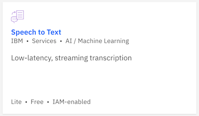

# Overview 

The IBM Watson™ Speech to Text service provides speech transcription capabilities for your applications. The service leverages machine learning to combine knowledge of grammar, language structure, and the composition of audio and voice signals to accurately transcribe the human voice. It continuously updates and refines its transcription as it receives more speech.

The service provides APIs that make it suitable for any application where speech is the input and a textual transcript is the output.

## Node-RED Watson Speech to Text node
The Node-RED  node provides a very easy wrapper node to convert human voice into written words

## In this hands-on lab we will use the Speech to text Node to work with 
- Convert a URL passed in our Node-RED Flow
-  A stand-alone system (using a local file or your microphone)

### Prerequisites
To get the Speech to Text service credentials on IBM Cloud automatically filled-in by Node-RED, you should connect the Speech to Text service to the Node-RED application in IBM Cloud.

