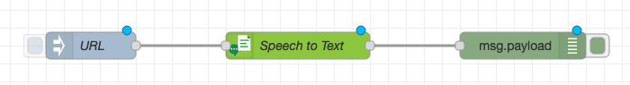
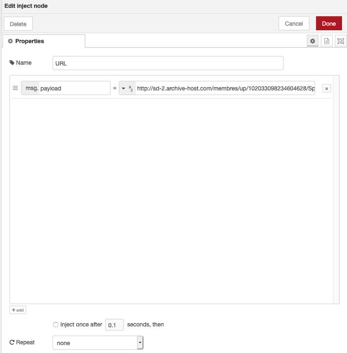
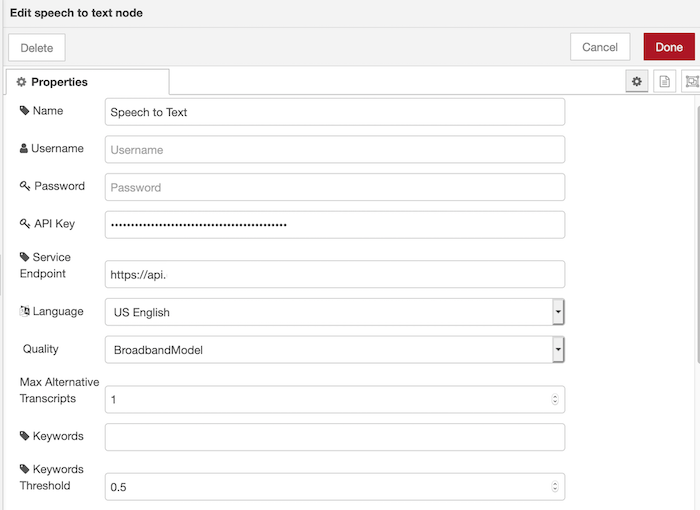
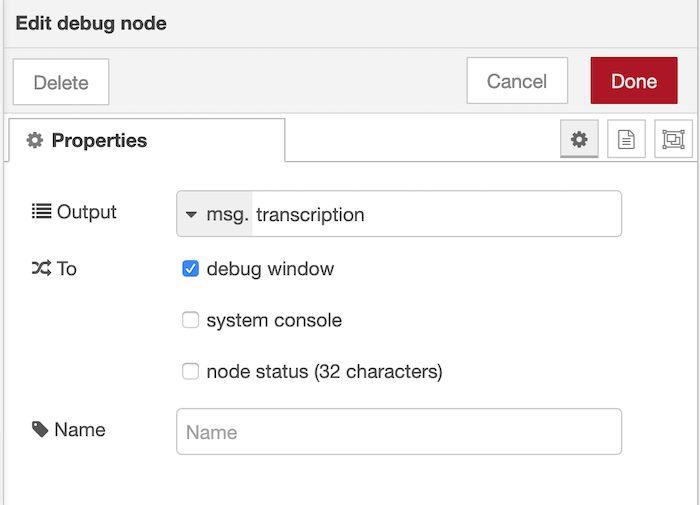
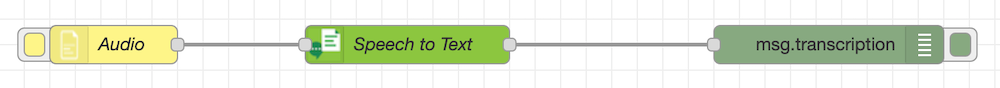

# Overview 

The IBM Watson™ Speech to Text service provides speech transcription capabilities for your applications. The service leverages machine learning to combine knowledge of grammar, language structure, and the composition of audio and voice signals to accurately transcribe the human voice. It continuously updates and refines its transcription as it receives more speech.

The service provides APIs that make it suitable for any application where speech is the input and a textual transcript is the output.

## Node-RED Watson Speech to Text node
The Node-RED  node provides a very easy wrapper node to convert human voice into written words

## In this hands-on lab we will use the Speech to text Node to: 
- Convert a URL passed in our Node-RED Flow
- A stand-alone system (using a local file or your microphone)

### Prerequisites
To get the Speech to Text service credentials on IBM Cloud automatically filled-in by Node-RED, you should connect the Speech to Text service to the Node-RED application in IBM Cloud.

### Setup 

Click on the tile shown above in your IBM cloud dashboard and click create 

### Make sure to Copy your API credentials to use in Node-RED

## Part 1. Uploading from a URL 

In this step, an audio file will be transcribed. An example audio file can be found [here](http://sd-2.archive-host.com/membres/up/102033098234604628/SpaceShuttle.wav). Feel free to use this URL or provide your own.

Start by adding an Inject node to your Flow, the Audio file will be added using the inject node to pass to the Speech to Text Service. 

Configure your Inject Node as shown 

### Next, add a Speech to Text node. This will stream the .wav file from the URL provided and transcribe it. Configure the node like this:

### make sure to copy the API credentials from the Speech to Text service created on IBM Cloud

The .wav file provided as an example is in English. If you're using your own file in a different language make sure to change it the language in the Speech to Text node. You can also select the quality of your .wav file (narrowband or broadband) and choose whether you want the speaker labels to be on to identify which individuals are speaking.

Finally add a debug node. This will allow you to see the results of the transcription. Configure as follows 

### Part 2 : You can also choose to upload the file from your system or use your microphone

The audio file can be downloaded [here](http://sd-2.archive-host.com/membres/up/102033098234604628/SpaceShuttle.wav) (click the download arrow).

Start by using the File Inject Node and build the flow as shown below 

Continue by adding the Speech to Text node after the File Inject Node. You will need the username and password from the Speech to Text service in IBM Cloud. Configurations remain the same as step 1 

Finally, add a Debug node. You need to configure this for getting the output in the debug window. The Speech to Text node outputs the transcribed text into msg.transcription so you need to set the debug node to listen for <b> msg.transcription </b> as done in the previous step 

### Using the Microphone Node : You can also use the microphone node as Input for the Speech to text node 

Wire together the Flow as shown below. 

Use the Input option on your microphone node to start/stop your recording. This will automatically take input from your system microphone and transcribe the text in the Debug Window. 

### Wire all the nodes together and click on 'Deploy'. Initiate the Inject node, File in, or Microphone node and you will see the transcribed text from the audio file in the debug window.
 

